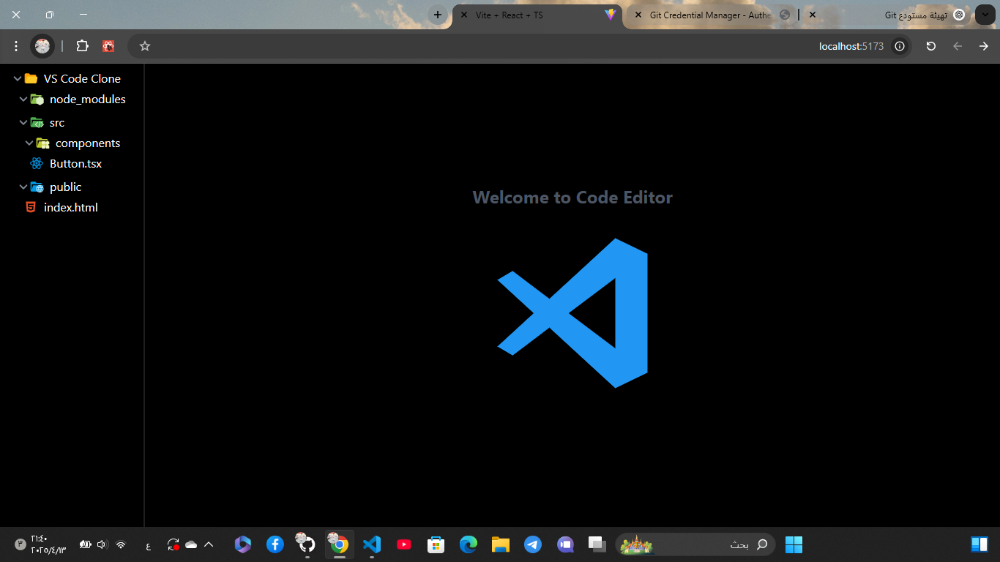
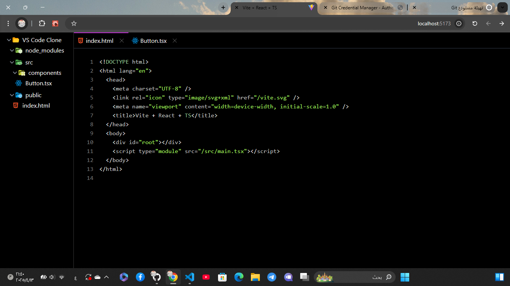

# VS Code Clone - React + TypeScript + Tailwind + Redux

An application that simulates the **VS Code** environment using **React** and **TypeScript**, with responsive design powered by **Tailwind CSS**, and state management using **Redux Toolkit**.

## 🚀 Technologies Used

-  **React**: A library for building user interfaces.
-  **TypeScript**: A programming language that enhances safety and helps write more organized code.
-  **Tailwind CSS**: A framework for flexible and responsive UI design.
-  **Redux Toolkit**: A powerful library for state management in React applications.
-  **Vite**: A fast build tool for web application development.

## ✨ Features

- A user interface similar to **VS Code**.
- State management using **Redux Toolkit**.
- Responsive and fast design with **Tailwind CSS**.
- **TypeScript** support for better code quality.

## 📸 Project Screenshots

### User Interface:




## 🛠️ How to Run

1. Install dependencies:

```bash
npm install
```

2. Run the application in development mode:

```bash
npm run dev
```

3. Open your browser at the following URL:

```
http://localhost:5173
```

4. Enjoy the application!
